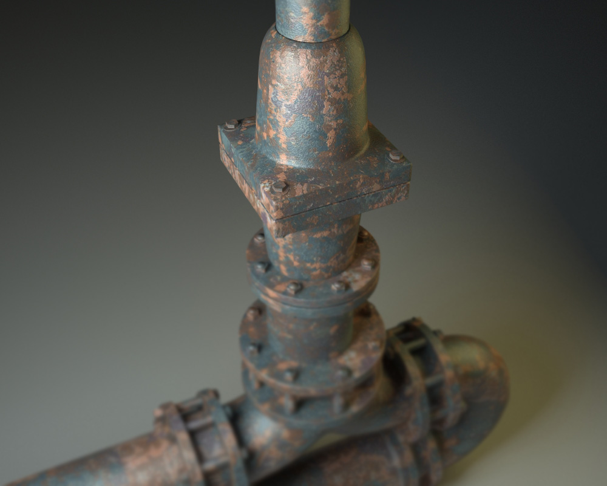
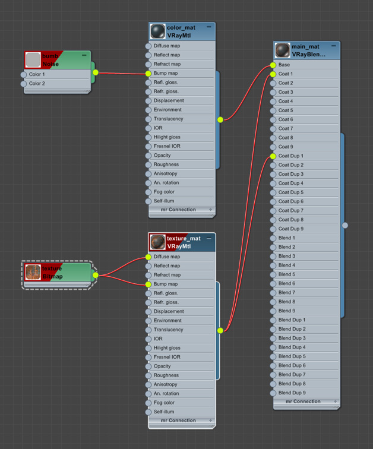
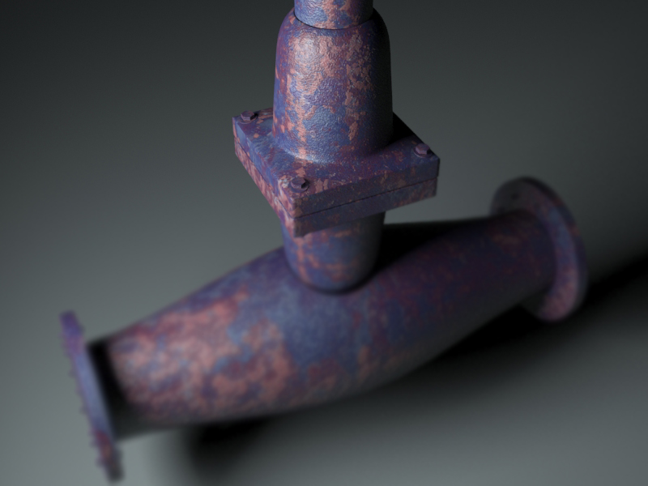

# V-Ray Blend Material Examples (3ds Max)

A **V-Ray Blend Material** example for **Autodesk 3ds Max**.

This scene was originally created in **2013** to demonstrate how **VRayBlendMtl** works by layering multiple materials together. The included `.max` file lets you inspect the material setup directly, making it useful for learning, experimentation, and reference.

---

## Preview

---

## What is Included

- Ready-to-open `.max` scene
- Working V-Ray Blend Material examples
- Layered material setup
- Editable material network
- Reference scene for learning and testing

---

## Purpose

This project was created to help artists understand how **VRayBlendMtl** combines multiple materials into a single shader.

Instead of explaining the concept with screenshots, the repository includes the actual 3ds Max scene so you can explore every material, mask, and parameter yourself.

---

## Requirements

- Autodesk 3ds Max
- V-Ray compatible with your version of 3ds Max

> Since this project was created in **2013**, newer versions of V-Ray may automatically convert some materials when opening the scene.

---

## Download

Download the included `.max` scene and open it in 3ds Max to inspect the material setup, experiment with the layers, and use it as a learning reference.

---

## License

This project is released for **free**.

You may:
- ✅ Use it for learning
- ✅ Use it in personal projects
- ✅ Use it in commercial projects
- ✅ Modify the scene

You may **not**:
- ❌ Sell the scene by itself
- ❌ Re-upload it as your own work
- ❌ Claim authorship of the original scene

Attribution is appreciated but not required.

---

## Author

**Mark Hunanyan**

Originally created in **2013**.

If you find this project useful, consider giving the repository a ⭐.
